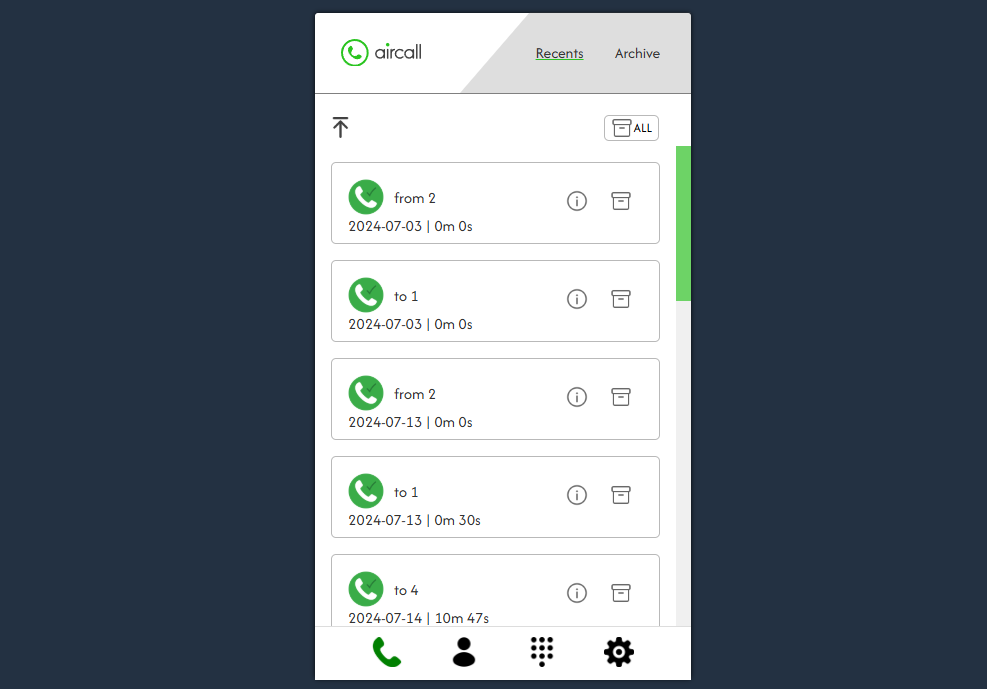
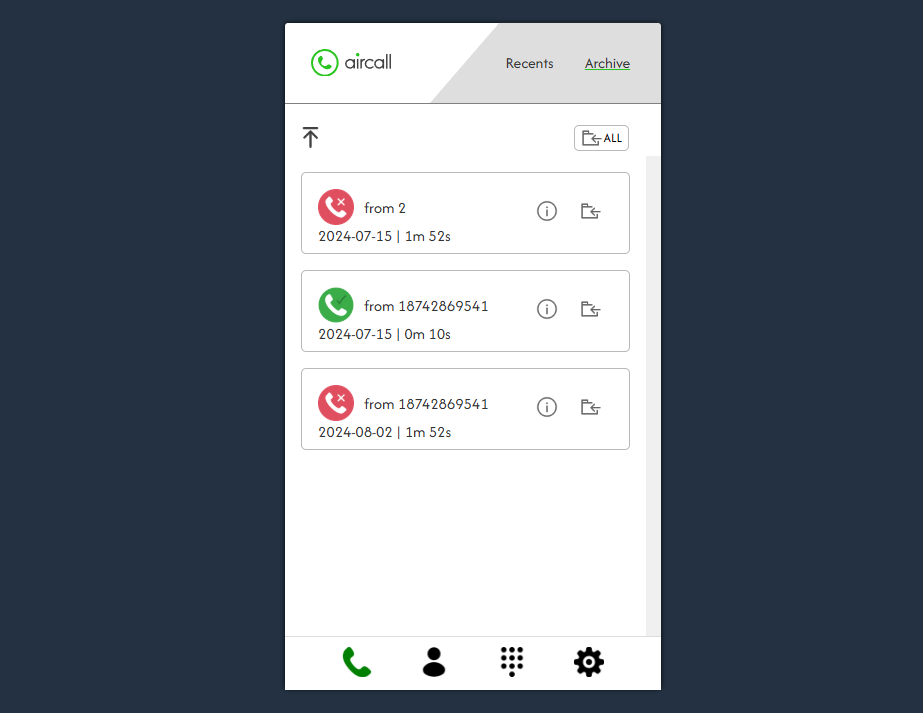
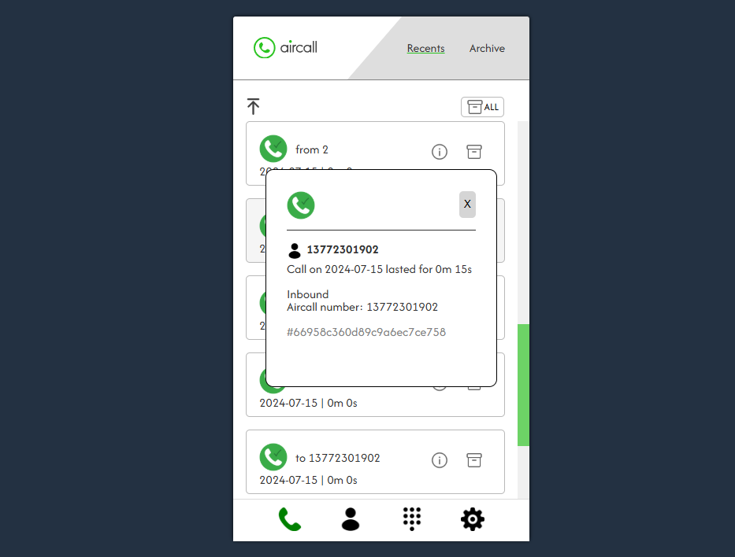
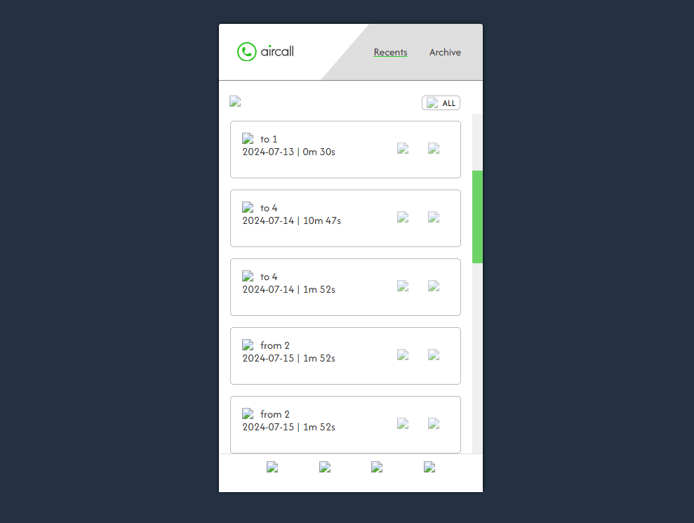

## Welcome to Cynthia's version of Aircall!

This is the Front End Development Challenge from Speer Technologies.

The goal of this test was to implement a small ReactJS app with the following features:
- **Activity Feed** - simple list of calls
- **Activity Detail** - detail of a call
- **Archive** - the final user should be able to archive (and unarchive) a call. Archived calls will no longer be displayed on the Activity Feed and should have a separate Archived Tab.
- A button to archive all calls in the activity feed
- A button to unarchive all calls in the archived calls tab

## Installation

```
npm install
npm start
```
**Note**: Please make sure to run the app in Node 16.

## Screenshots

At the moment, there is no landing page. When you launch the app, you will start in the Activity Feed


The archive tab


You can select a call to view more details


## Next Steps

If given more time, I would love to:
- Implement the return-to-top button
- Implement all the tabs (footer is currently just a skeleton)
- Clean up components by moving functions to another file or a custom hook
- Really hone in on a theme/colour scheme including cohesive logos
- Improve the overall look of the modal
- Unfortunately I am having issues with Netlify rendering images - after much sweat and tears shed, I would love to ask a mentor/Senior for some help!


## Acknowledgements

- Thanks to Julia, Mathew, and Speer Technologies for this fun learning exercise! 
